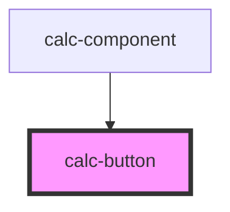

# med-badge

<!-- Auto Generated Below -->

## Properties

| Property         | Attribute         | Description | Type                                           | Default     |
| ---------------- | ----------------- | ----------- | ---------------------------------------------- | ----------- |
| `buttonColor`    | `button-color`    |             | `EnumButtonColor.GREEN \| EnumButtonColor.RED` | `undefined` |
| `buttonType`     | `button-type`     |             | `EnumButtonType`                               | `undefined` |
| `responsiveSize` | `responsive-size` |             | `boolean`                                      | `false`     |

## Events

| Event         | Description | Type                  |
| ------------- | ----------- | --------------------- |
| `buttonClick` |             | `CustomEvent<string>` |

## Dependencies

### Used by

 - [calc-component](../calc-component)

### Graph

----------------------------------------------

*Built with [StencilJS](https://stenciljs.com/)*
