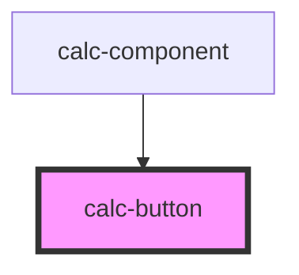

# med-badge

<!-- Auto Generated Below -->

## Properties

| Property      | Attribute      | Description | Type                                                                                                                                                                                                                                                                                                                                                                                                                                                                                                                      | Default     |
| ------------- | -------------- | ----------- | ------------------------------------------------------------------------------------------------------------------------------------------------------------------------------------------------------------------------------------------------------------------------------------------------------------------------------------------------------------------------------------------------------------------------------------------------------------------------------------------------------------------------- | ----------- |
| `buttonColor` | `button-color` |             | `EnumButtonColor.GREEN \| EnumButtonColor.RED`                                                                                                                                                                                                                                                                                                                                                                                                                                                                            | `undefined` |
| `buttonType`  | `button-type`  |             | `EnumButtonType.ADD \| EnumButtonType.BACKSPACE \| EnumButtonType.CLEAR \| EnumButtonType.DIVIDE \| EnumButtonType.DOT \| EnumButtonType.EQUAL \| EnumButtonType.MULTIPLY \| EnumButtonType.NUMBER0 \| EnumButtonType.NUMBER1 \| EnumButtonType.NUMBER2 \| EnumButtonType.NUMBER3 \| EnumButtonType.NUMBER4 \| EnumButtonType.NUMBER5 \| EnumButtonType.NUMBER6 \| EnumButtonType.NUMBER7 \| EnumButtonType.NUMBER8 \| EnumButtonType.NUMBER9 \| EnumButtonType.SQRT \| EnumButtonType.SQUARE \| EnumButtonType.SUBTRACT` | `undefined` |

## Events

| Event         | Description | Type                  |
| ------------- | ----------- | --------------------- |
| `buttonClick` |             | `CustomEvent<string>` |

## Dependencies

### Used by

 - [calc-component](../calc-component)

### Graph

----------------------------------------------

*Built with [StencilJS](https://stenciljs.com/)*
