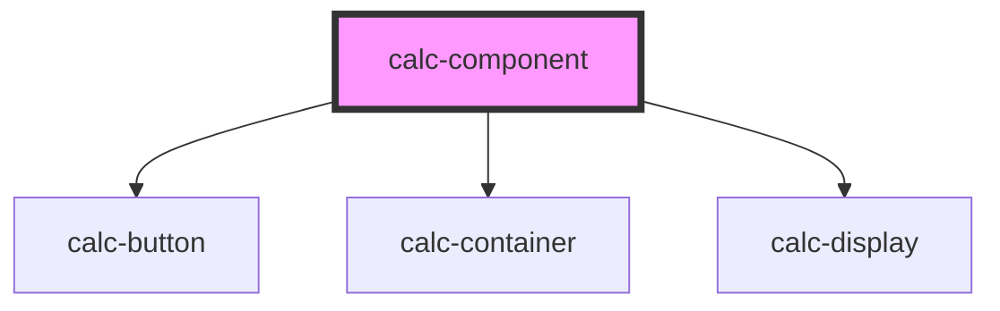

# calc-container

<!-- Auto Generated Below -->

## Properties

| Property           | Attribute            | Description | Type      | Default |
| ------------------ | -------------------- | ----------- | --------- | ------- |
| `calcDisplayData`  | `calc-display-data`  |             | `string`  | `''`    |
| `calcDisplayInput` | `calc-display-input` |             | `string`  | `''`    |
| `responsiveSize`   | `responsive-size`    |             | `boolean` | `false` |

## Dependencies

### Depends on

- [calc-button](../calc-button)
- [calc-container](../calc-container)
- [calc-display](../calc-display)

### Graph

----------------------------------------------

*Built with [StencilJS](https://stenciljs.com/)*
