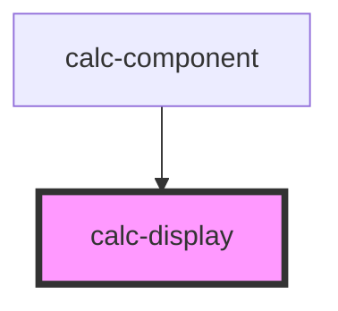

# calc-container

<!-- Auto Generated Below -->

## Properties

| Property    | Attribute    | Description | Type     | Default     |
| ----------- | ------------ | ----------- | -------- | ----------- |
| `calcData`  | `calc-data`  |             | `string` | `undefined` |
| `calcInput` | `calc-input` |             | `string` | `undefined` |

## Dependencies

### Used by

 - [calc-component](../calc-component)

### Graph

----------------------------------------------

*Built with [StencilJS](https://stenciljs.com/)*
